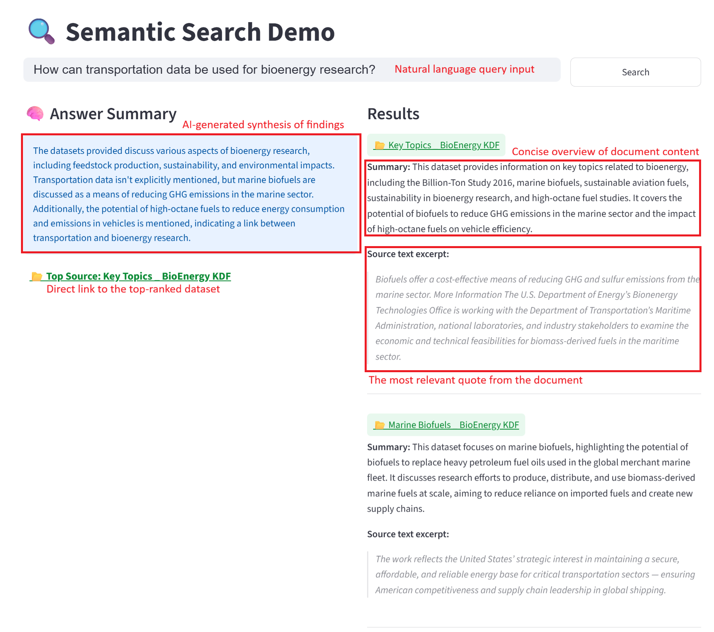

# SEED: Semantic Energy Exploration and Discovery

The growing volume of data within energy and bioenergy frameworks has outpaced traditional retrieval methods. Standard lexical (keyword-based) search creates two critical pain points: 

1. Relevancy Gaps: Keyword matching often returns a high volume of raw documents that mention a term but do not contain the specific answer, forcing users to manually parse through large datasets.

2. The Expertise Barrier: Effective search currently requires domain-specific vocabulary. Users without deep technical expertise often struggle to formulate the exact queries needed to surface relevant results.

SEED allows you to query complex document repositories using natural language. Beyond a simple list of results, the tool provides a concise summary grounded in the data, alongside ranked source documents and the specific passages relevant to your question, saving you from manually searching through lengthy files.

## How It Works

The system uses an approach called **Retrieval-Augmented Generation (RAG)**, which works in two stages:

1. **Finding relevant content (Retrieval)**
   When you type a question, the system does not just look for matching keywords. Instead, it understands the *meaning* of your question and compares it against the meaning of every document in its knowledge base. This is called **semantic search** — it finds documents that are relevant even if they do not share the exact same words as your question.

   To do this, documents are converted into numerical representations called **embeddings** — a way of encoding meaning mathematically — and stored in a **vector database** (a special database optimized for this kind of similarity search).

2. **Generating an answer (Generation)**
   Once the most relevant documents are found, they are passed to a **Large Language Model (LLM)** — an AI system (like GPT or Gemini) that reads the retrieved content and writes a clear, concise answer in plain language. The LLM only uses the retrieved documents to answer, so responses are grounded in your actual data.

The result is three things: a plain-language **AI summary**, the **source document** the answer came from, and the **exact quote** within that document.



## Getting Started

### 1. Clone the repository

```
git clone <repository-url>
cd semantic-search-engine
```

### 2. Install dependencies

```
pip install uv
uv sync
```

### 3. Configure the system

Open `config.yaml` and adjust the settings to your needs (see the Configuration section below). At minimum, you will need to add an API key for whichever LLM provider you choose.

### 4. Run the application

```
streamlit run app.py
```

A browser window will open with a search bar. Type your question and click **Search**.

---

## Configuration

All user-adjustable settings are in `config.yaml`. You do not need to touch any other files.

### Choosing an LLM

The LLM is the AI model that reads your documents and writes the answer. Several providers are supported out of the box:

| Name in config | Provider | Model |
|---|---|---|
| `gemini_pro` | Google Gemini | gemini-2.5-flash |
| `gemini_flash` | Google Gemini | gemini-2.0-flash |
| `openai_mini` | OpenAI | gpt-4o-mini |
| `groq_llama` | Groq | Llama 3.1 8B |
| `groq_llama2` | Groq | Llama 4 Scout |
| `anthropics` | Anthropic | Claude 3 Haiku |

To switch LLMs, change the `active_student` value under `generation:`:

```yaml
generation:
  active_student: "openai_mini"   # change this to any name from the table above
```

Each provider requires its own API key set as an environment variable (e.g., `OPENAI_API_KEY`, `GOOGLE_API_KEY`, `GROQ_API_KEY`, `ANTHROPIC_API_KEY`). API keys can be obtained for free or at low cost from the respective provider website.

### Choosing an Embedding Model

The embedding model controls how documents and questions are converted into meaning-based representations for search. Switching models can affect search quality.

| Name in config | Model |
|---|---|
| `mini_lm` | all-MiniLM-L6-v2 (default, fast) |
| `gte` | gte-small |
| `bge` | bge-small-en-v1.5 |
| `e5` | e5-small-v2 |
| `snowflake` | snowflake-arctic-embed-xs |

To switch embedding models, change `active_embedding` under `retrieval:`:

```yaml
retrieval:
  active_embedding: "bge"   # change this to any name from the table above
```

> **Note:** The embedding model must match the one used when the documents were originally indexed. If you change it, you will need to re-run the ingestion step to rebuild the database with the new model.

### Other Settings

```yaml
data:
  chunk_size: 256       # how many words each document excerpt contains
  chunk_overlap: 40     # overlap between consecutive excerpts (helps preserve context at boundaries)

retrieval:
  num_docs: 5           # how many source documents to retrieve per query
  chunks_per_doc: 2     # how many excerpts to pull from each document
```

---

## What You Get Back

For every question, the application returns three things:

1. **AI Summary** — A plain-language answer written by the LLM, based on the retrieved content.
2. **Source Reference** — The name of the document or dataset the answer was drawn from.
3. **Direct Quote** — The exact passage from the original document that supports the answer.